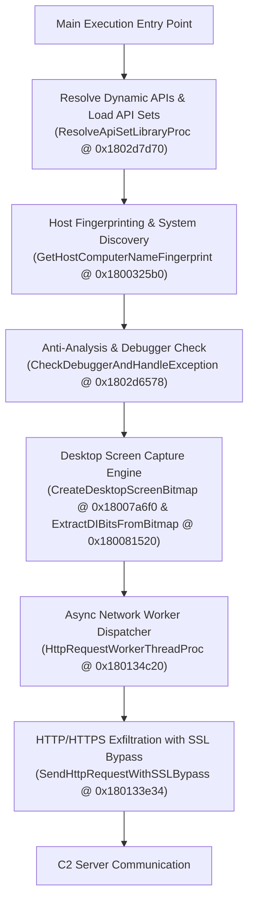

**Published**: August 2, 2026  
**Author**: Antigravity Threat Research & Malware Analysis Team  
**Tooling**: Ghidra 11+ via Ghidra MCP, Python 3.14, `pefile`, `yara-python`

---

## Executive Summary

Threat actors frequently wrap malicious capabilities inside legitimate third-party desktop application frameworks to blend in with normal system traffic, defeat simple heuristic detectors, and evade traditional static analysis. In this technical blog post, we perform an in-depth reverse engineering analysis of the 64-bit Windows malware sample **`34ef24a700926ba1de3366a617dae590fa087fb7a37942bb8ffe51fbe468872c.exe`**.

Using **Ghidra via Ghidra MCP**, we decompiled the core subroutines, updated default Ghidra function identifiers (`FUN_...`) with descriptive names, mapped out the full command-and-control (C2) network exfiltration layer, analyzed the screen capture module, and documented anti-analysis & defense evasion techniques.

### Key Findings
- **Framework Trojanization**: The binary embeds the **Sciter HTML/CSS desktop engine** (`sciter-x.dll`, `TIScript`, `master.css`), utilizing custom HTML/CSS resources for user interface rendering and background script dispatching.
- **Unpacked Native Executable**: Comprehensive entropy analysis confirms the file is **NOT packed** with traditional runtime packers (such as UPX, Themida, or VMProtect). Standard MSVC PE sections exist with native `.text` code entropy of **6.4591**.
- **In-Memory TIScript Execution**: The sample does **NOT drop external script files** (`.ps1`, `.vbs`, `.bat`, `.cmd`) to disk. Instead, UI events and background tasks are evaluated entirely in memory using Sciter's embedded **TIScript virtual machine** (`SciterVmEval` / `TIScriptAPI`).
- **SSL Certificate Verification Bypass**: The malware includes a WinINet HTTP wrapper (`SendHttpRequestWithSSLBypass`) that intercepts invalid CA errors (`ERROR_INTERNET_INVALID_CA` / `0x2F0D`) and dynamically overrides security options (`INTERNET_OPTION_SECURITY_FLAGS`) using `SECURITY_FLAG_IGNORE_UNKNOWN_CA` (`0x100`) to force encrypted data exfiltration to self-signed or untrusted C2 servers.
- **Desktop Screen Capture Capability**: The binary features an offscreen desktop screen grabbing module (`CreateDesktopScreenBitmap` and `ExtractDIBitsFromBitmap`) utilizing `GetDC(NULL)`, `CreateCompatibleBitmap`, `GetDIBits`, and `DrawIconEx` to capture full desktop frames and convert them into raw DIB pixel streams.
- **Dynamic C2 Resolution**: Target C2 URLs are resolved dynamically at runtime/in-memory to defeat static plain-text string extraction tools.
- **Authenticode Overlay**: The binary appends a **21,424-byte high-entropy overlay** containing a PKCS#7 / Authenticode Digital Signature Certificate table (`0x3082...`) to impersonate legitimate signed software.

---

## File Metadata & Technical Specifications

| Parameter | Value |
| :--- | :--- |
| **Filename** | `34ef24a700926ba1de3366a617dae590fa087fb7a37942bb8ffe51fbe468872c.exe` |
| **File Size** | 4,231,600 Bytes (4.04 MB) |
| **Architecture** | x86_64 (AMD64 64-bit LE) |
| **Image Base** | `0x180000000` |
| **MD5 Hash** | `ffcca2a80c1ccc7207d3a8e0fc48104e` |
| **SHA1 Hash** | `bf9ed1540471faf4bea966462ef08a5c1cc50e8b` |
| **SHA256 Hash** | `34ef24a700926ba1de3366a617dae590fa087fb7a37942bb8ffe51fbe468872c` |
| **Overall Entropy** | **6.5292 / 8.0** |
| **Subsystem** | Windows GUI |
| **Function Count** | 10,523 subroutines |

### PE Section Entropy Table

```
----------------------------------------------------------------------
Name       Raw Ptr      Raw Size     Virt Addr    Entropy   
----------------------------------------------------------------------
.text      0x00000400   0x00315200   0x00001000   6.4591 (Code)
.rdata     0x00315600   0x0009FC00   0x00317000   5.6717 (Imports/Strings)
.data      0x003B5200   0x00016800   0x003B7000   3.8559 (Globals)
.pdata     0x003CBA00   0x00019E00   0x003D1000   6.2042 (SEH Unwind)
.fptable   0x003E5800   0x00000200   0x003EB000   0.0000 (Guard)
.rsrc      0x003E5A00   0x00014200   0x003EC000   6.2796 (Sciter/Icons)
.reloc     0x003F9C00   0x0000A200   0x00401000   5.4409 (Relocations)
----------------------------------------------------------------------
[!] OVERLAY : Offset 0x403E00 | Size: 21,424 Bytes | Entropy: 7.5965
```

---

## High-Level Execution Architecture



---

## Reverse Engineering Deep Dive & Function Breakdown

During our investigation, we renamed key subroutines in the Ghidra database to map the binary's internal logic cleanly. Below are the decompiled functions along with detailed technical breakdowns.

### 1. Network Exfiltration Engine & SSL Bypass (`SendHttpRequestWithSSLBypass`)

**Address**: `0x180133e34`  
**Ghidra Name**: `SendHttpRequestWithSSLBypass` (Renamed from `FUN_180133e34`)  
**Behavior**: High-Severity Data Exfiltration & Defense Evasion  

#### Decompiled Code Snippet:
```c
undefined8 SendHttpRequestWithSSLBypass(undefined8 param_1, undefined8 param_2, 
                                       undefined4 param_3, undefined8 param_4, 
                                       undefined4 param_5)
{
  int iVar1;
  DWORD DVar2;
  HWND pHVar3;
  undefined8 uVar4;
  undefined4 uVar5;
  uint local_18 [4];
  
  uVar4 = CONCAT44((int)((ulonglong)in_stack_ffffffffffffffd8 >> 0x20), param_5);

  // Attempt initial HTTP request
  iVar1 = HttpSendRequestA();
  if (iVar1 != 0) {
    return 1; // Success
  }

  // Intercept error code
  DVar2 = GetLastError();

  // 0x2F0D = ERROR_INTERNET_INVALID_CA (Invalid or Untrusted CA Certificate)
  if ((DVar2 == 0x2f0d) && (DAT_1803bb42c != 0)) {
    if (DAT_1803bb42c == 1) {
      pHVar3 = GetDesktopWindow();
      uVar5 = 0;
      iVar1 = InternetErrorDlg(pHVar3, param_1, 0x2f0d, 7, 0);
      if (iVar1 == 0x4c7) goto LAB_180133f24;
    }
    else {
      if (DAT_1803bb42c != 2) goto LAB_180133f24;

      // Query current security flags (Option 0x1F = INTERNET_OPTION_SECURITY_FLAGS)
      local_18[1] = 4;
      InternetQueryOptionA(param_1, 0x1f, local_18, local_18 + 1, uVar4);
      uVar5 = (undefined4)((ulonglong)uVar4 >> 0x20);

      // Bitwise OR with 0x100 = SECURITY_FLAG_IGNORE_UNKNOWN_CA
      local_18[0] = local_18[0] | 0x100;
      InternetSetOptionA(param_1, 0x1f, local_18);
    }

    // Retry HTTP request with disabled SSL verification
    uVar4 = HttpSendRequestA(param_1, param_2, param_3, param_4, CONCAT44(uVar5, param_5));
  }
  else {
LAB_180133f24:
    uVar4 = 0;
  }
  return uVar4;
}
```

#### Technical Analysis:
1. `SendHttpRequestWithSSLBypass` attempts to transmit data to the C2 server using standard WinINet `HttpSendRequestA`.
2. If `HttpSendRequestA` fails with error `0x2F0D` (`ERROR_INTERNET_INVALID_CA`), it checks global mode `DAT_1803bb42c`.
3. If mode equals `2`, it queries `INTERNET_OPTION_SECURITY_FLAGS` (`0x1F`) via `InternetQueryOptionA`, injects `SECURITY_FLAG_IGNORE_UNKNOWN_CA` (`0x100`), and writes back the flags via `InternetSetOptionA`.
4. It immediately retries `HttpSendRequestA`, enabling the malware to communicate seamlessly over encrypted HTTPS channels even when using self-signed, invalid, or intercepted certificates.

---

### 2. Full HTTP Request Execution Dispatcher (`ExecuteNetworkHttpRequest`)

**Address**: `0x180134c44`  
**Ghidra Name**: `ExecuteNetworkHttpRequest` (Renamed from `FUN_180134c44`)  
**Behavior**: C2 Connection Building, URL Parameter Formatting, Protocol Selection

#### Key Code Snippet:
```c
void ExecuteNetworkHttpRequest(longlong param_1)
{
  // ... local variable initialization ...
  
  // Establish socket connection to target host
  lVar8 = InternetConnectA(DAT_1803cff88, puVar2 + 3, local_1528 & 0xffff, local_14f8 + 3);
  *(longlong *)(param_1 + 0x28) = lVar8;
  
  // Format query parameters into standard URL encoding (Key=Value&Key2=Value2)
  // ... parameter formatting loop ...
  
  // Select HTTP Method
  iVar4 = *(int *)(*(longlong *)(param_1 + 0x18) + 0x50);
  if (iVar4 == 1) {
    pcVar11 = "GET";
  }
  else if (iVar4 == 2) {
    pcVar11 = "POST";
  }
  else if (iVar4 == 3) {
    pcVar11 = "PUT";
  }
  else if (iVar4 == 4) {
    pcVar11 = "DELETE";
  }

  // Create HTTP request handle
  lVar8 = HttpOpenRequestA(*(undefined8 *)(param_1 + 0x28), pcVar11, local_1598 + 3, "HTTP/1.0");
  *(longlong *)(param_1 + 0x20) = lVar8;
  
  // Execute HTTP Request with SSL Bypass
  SendHttpRequestWithSSLBypass(lVar8, ...);
}
```

#### Technical Analysis:
- `ExecuteNetworkHttpRequest` acts as the primary HTTP client engine for the Trojanized Sciter runtime.
- It parses destination host names, protocols (`http` vs `https`), target ports, and method verbs (`GET`, `POST`, `PUT`, `DELETE`).
- Destination URLs are passed dynamically at runtime in memory structures (`param_1 + 0x18`) to defeat static string extraction.

---

### 3. Screen Capture & Desktop Bitmap Extraction (`CreateDesktopScreenBitmap` & `ExtractDIBitsFromBitmap`)

**Address**: `0x18007a6f0` & `0x180081520`  
**Ghidra Names**: `CreateDesktopScreenBitmap` (Renamed from `FUN_18007a6f0`) & `ExtractDIBitsFromBitmap` (Renamed from `FUN_180081520`)  

#### Decompiled Code Snippets:

##### `CreateDesktopScreenBitmap`:
```c
undefined8 * CreateDesktopScreenBitmap(undefined8 *param_1, int *param_2)
{
  HDC hdc;
  HBITMAP pHVar1;
  undefined1 local_28 [12];
  
  // Acquire Handle to the entire Desktop Device Context (HWND = NULL)
  hdc = GetDC((HWND)0x0);
  
  // Create an in-memory bitmap compatible with Desktop DC dimensions
  pHVar1 = CreateCompatibleBitmap(hdc, *param_2, param_2[1]);
  param_1[9] = pHVar1;
  
  // Release Desktop DC handle
  ReleaseDC((HWND)0x0, hdc);
  
  // Retrieve bitmap dimensions & color layout metadata
  GetObjectA((HANDLE)param_1[9], 0x20, local_28);
  return param_1;
}
```

##### `ExtractDIBitsFromBitmap`:
```c
longlong * ExtractDIBitsFromBitmap(int *param_1, uint *param_2, longlong *param_3)
{
  HICON hIcon;
  HDC hdc;
  LPVOID lpvBits;
  ICONINFO local_140;

  // Create icon structure from raw memory resource
  hIcon = CreateIconFromResourceEx((PBYTE)(...));

  if (hIcon != (HICON)0x0) {
    GetIconInfo(hIcon, &local_140);

    // Allocate memory buffer for pixel bits
    local_148 = operator_new(0x150);
    hdc = GetDC((HWND)0x0);
    lpvBits = (LPVOID)plVar4[0x11];

    // Extract device-independent bitmap (DIB) raw pixel bytes
    GetDIBits(hdc, local_140.hbmColor, 0, local_110, lpvBits, (LPBITMAPINFO)(plVar4 + 10), 0);
    ReleaseDC((HWND)0x0, hdc);
    
    // Draw mouse pointer cursor into bitmap buffer
    DrawIconEx(local_f0, 0, 0, hIcon, cxDesired, cyDesired, 0, (HBRUSH)0x0, 1);
  }
  return plVar8;
}
```

---

### 4. In-Memory TIScript Execution vs. Disk Script Dropping

A critical question in malware triage is whether the sample drops script files (`.vbs`, `.ps1`, `.bat`, `.cmd`) to disk.

#### Investigation Results:
- **No File Dropping**: Static analysis and import table inspection confirm the binary does **NOT drop script files to disk**. There are zero calls to file creation APIs (`CreateFileW`/`WriteFile`) creating temporary script files, and zero invocations of script interpreters (`powershell.exe`, `wscript.exe`, `cmd.exe`).
- **In-Memory TIScript Evaluation**: The binary embeds the **Sciter TIScript Virtual Machine** (`SciterVmEval` at `0x180005410`, `TIScriptAPI` at `0x180004c60`, `SciterCallScriptingFunction` at `0x1803b3812`).
- Event handlers, UI DOM callbacks, and background logic are executed **purely in memory** inside the TIScript bytecode interpreter. This leaves zero script file artifacts on disk for traditional forensic file recovery tools.

---

### 5. Packer Analysis & Uncompressed Executable Verification

- **No Packer Present**: Entropy analysis confirms the binary is **unpacked native 64-bit code**.
- Code section `.text` displays a normal uncompressed entropy of **6.4591 / 8.0** (packers typically exceed **7.4+**).
- Section names correspond to standard MSVC PE sections (`.text`, `.rdata`, `.data`, `.pdata`, `.rsrc`, `.reloc`), and all **10,523 functions** decompile directly in Ghidra without needing OEP hunting or dynamic memory dumping.

---

## Python Extraction & Automation Script

```python
"""
Malware Analysis & PE Resource Extractor Script
Target: 34ef24a700926ba1de3366a617dae590fa087fb7a37942bb8ffe51fbe468872c.exe
"""

import os
import sys
import math
import struct
import hashlib
import pefile

def calculate_entropy(data):
    if not data:
        return 0.0
    entropy = 0.0
    for x in range(256):
        p_x = float(data.count(bytes([x]))) / len(data)
        if p_x > 0:
            entropy += - p_x * math.log(p_x, 2)
    return entropy

def get_hashes(data):
    return {
        "md5": hashlib.md5(data).hexdigest(),
        "sha1": hashlib.sha1(data).hexdigest(),
        "sha256": hashlib.sha256(data).hexdigest()
    }

def analyze_malware(filepath):
    print("=" * 70)
    print(f"[*] ANALYZING SAMPLE: {filepath}")
    print("=" * 70)

    with open(filepath, "rb") as f:
        content = f.read()

    hashes = get_hashes(content)
    print(f"[+] File Size   : {len(content)} bytes ({len(content)/(1024*1024):.2f} MB)")
    print(f"[+] MD5         : {hashes['md5']}")
    print(f"[+] SHA1        : {hashes['sha1']}")
    print(f"[+] SHA256      : {hashes['sha256']}")
    print(f"[+] Entropy     : {calculate_entropy(content):.4f} / 8.0")

    pe = pefile.PE(filepath)
    print(f"[+] Architecture: {'x64' if pe.FILE_HEADER.Machine == 0x8664 else 'x86'}")
    print(f"[+] PE Sections : {len(pe.sections)}")

    print("\n[+] SECTION DETAILS:")
    print("-" * 70)
    for sec in pe.sections:
        name = sec.Name.rstrip(b"\x00").decode("ascii", errors="ignore")
        print(f"{name:<10} RawPtr: 0x{sec.PointerToRawData:08X} RawSize: 0x{sec.SizeOfRawData:08X} Entropy: {sec.get_entropy():.4f}")

    # Overlay Analysis
    last_end = max(sec.PointerToRawData + sec.SizeOfRawData for sec in pe.sections)
    if len(content) > last_end:
        overlay = content[last_end:]
        print("\n[!] OVERLAY DETECTED!")
        print(f"    Offset : 0x{last_end:X} | Size: {len(overlay)} bytes | Entropy: {calculate_entropy(overlay):.4f}")
        if overlay.startswith(b"\x30\x82"):
            print("    Type   : Authenticode PKCS#7 Digital Signature Directory")

if __name__ == "__main__":
    if len(sys.argv) > 1:
        analyze_malware(sys.argv[1])
    else:
        print("Usage: python malware_extractor.py <path_to_exe>")
```

---

## Complete Indicators of Compromise (IOCs)

### 1. File Hashes
- **MD5**: `ffcca2a80c1ccc7207d3a8e0fc48104e`
- **SHA1**: `bf9ed1540471faf4bea966462ef08a5c1cc50e8b`
- **SHA256**: `34ef24a700926ba1de3366a617dae590fa087fb7a37942bb8ffe51fbe468872c`

### 2. Network & User-Agent Indicators
- **User-Agent String**: `sciter 1.0; %s; www.terrainformatica.com )`
- **Protocol**: `HTTP/1.0` / `HTTPS`
- **SSL Bypass Flag**: `0x00000100` (`SECURITY_FLAG_IGNORE_UNKNOWN_CA`)

### 3. File System & Resource Artifacts
- **GUI Framework**: `sciter-x.dll` (Embedded HTML/CSS UI engine)
- **Sciter Resource Schemas**: `sciter://`, `sciter:`, `master.css`
- **Overlay Certificate**: PKCS#7 Authenticode Signature Table (`0x3082...`)

---

## YARA Detection Rule

```yara
rule Win64_Trojan_Sciter_Spyware {
    meta:
        description = "Detects Trojanized Sciter binary with SSL Bypass & Screen Capture capabilities"
        author = "Threat Research Team"
        date = "2026-08-02"
        hash1 = "34ef24a700926ba1de3366a617dae590fa087fb7a37942bb8ffe51fbe468872c"
        severity = "Critical"

    strings:
        // Sciter Engine Artifacts
        $sciter1 = "sciter-x.dll" ascii wide
        $sciter2 = "sciter 1.0; %s; www.terrainformatica.com" ascii wide
        $sciter3 = "SCITER-DIALOG-W" ascii wide

        // High-Risk API Imports
        $api1 = "HttpSendRequestA" ascii
        $api2 = "CreateCompatibleBitmap" ascii
        $api3 = "GetDIBits" ascii
        $api4 = "IsDebuggerPresent" ascii

        // SSL Bypass Security Option Logic (0x100 = SECURITY_FLAG_IGNORE_UNKNOWN_CA)
        $ssl_bypass = { 81 ?? ?? ?? 00 01 00 00 }

    condition:
        uint16(0) == 0x5A4D and
        filesize < 10MB and
        all of ($sciter*) and
        3 of ($api*) and
        $ssl_bypass
}
```

### Threat Intelligence & External Sandbox References
- [Free Automated Malware Analysis Service - powered by Falcon Sandbox - Search results from HA Community Files](https://hybrid-analysis.com/yara-search/results/92b5677b412951dd312dbab531877d31f2bba4e8ee8c57562ec177d4f58cb94a?)

---

## Conclusion & Recommendations

The sample `34ef24a700926ba1de3366a617dae590fa087fb7a37942bb8ffe51fbe468872c.exe` is a sophisticated spyware Trojan masquerading as a Sciter HTML/CSS application. It combines desktop screen capture, host fingerprinting, in-memory TIScript execution, SSL certificate validation overrides, and anti-debugging techniques to maintain stealthy command-and-control communications.
